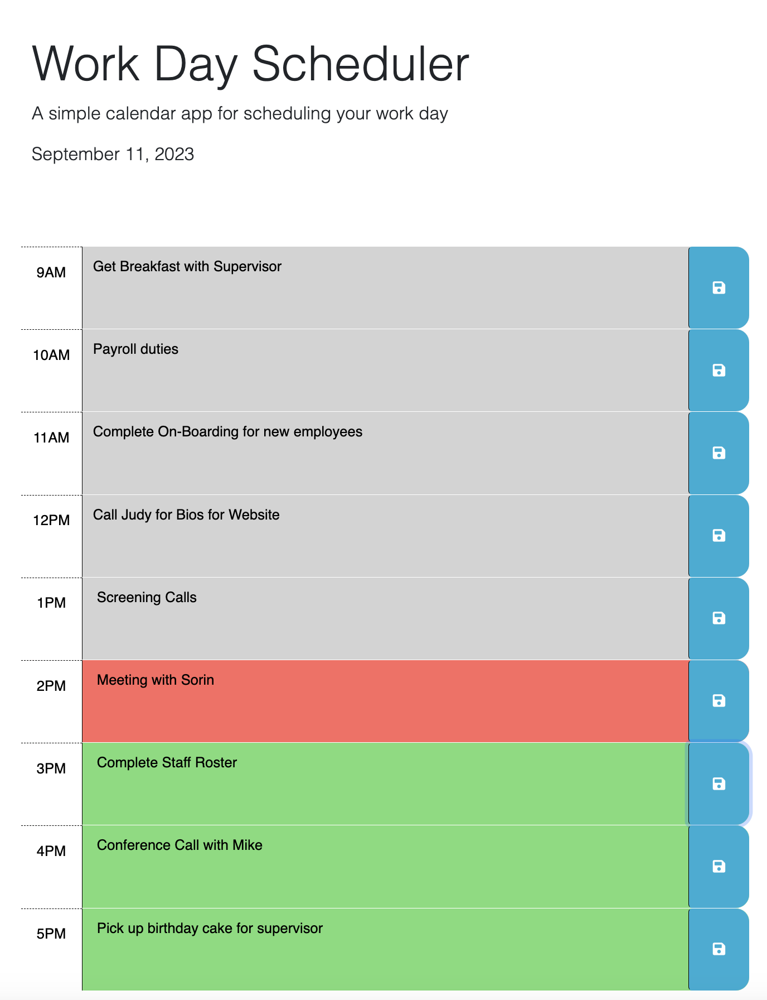

# Work Day Scheduler Starter Code

## Description
As someone who has a busy school and work schedule, my motivation for this project was to make an application that allowed a user to save events for each hour in a typical 9am-5pm day in order to manage time effectively.

This project taught me the importance of reading documentation and how much it can help your project. In this instance, I learned a lot about jQuery and using the Day.js library to work with this scheduler.

## Installation

Project as a repository on GitHub: https://github.com/renrojas/work-day-scheduler

Project deployed on GitHub Pages: https://renrojas.github.io/work-day-scheduler/

## Usage

To get started with this application, simply open it up and wite out a description or title of the event in the text-box next to the time and save it by clicking on the white floppy disk icon on the right. If you would like to edit the event, simply click on the event text-box, make the edit and save the event. Once you are done you can exit the page and your calendar will still be available when you open up the application again in the same browser.

Past events will show up in grey text-box, present events will show up in a red text-box and future events will show up in a green text-box.

## Credits

https://api.jquery.com/ready/#ready-handler - .ready()

https://api.jquery.com/category/traversing/ - Traversing

https://api.jquery.com/val/#val - .val()

https://day.js.org/docs/en/display/format - Day.js

https://api.jquery.com/text/#text - .text()

https://api.jquery.com/removeClass/#removeClass-className - .removeClass()

## License

MIT License

Copyright (c) 2023 renrojas

Permission is hereby granted, free of charge, to any person obtaining a copy
of this software and associated documentation files (the "Software"), to deal
in the Software without restriction, including without limitation the rights
to use, copy, modify, merge, publish, distribute, sublicense, and/or sell
copies of the Software, and to permit persons to whom the Software is
furnished to do so, subject to the following conditions:

The above copyright notice and this permission notice shall be included in all
copies or substantial portions of the Software.

THE SOFTWARE IS PROVIDED "AS IS", WITHOUT WARRANTY OF ANY KIND, EXPRESS OR
IMPLIED, INCLUDING BUT NOT LIMITED TO THE WARRANTIES OF MERCHANTABILITY,
FITNESS FOR A PARTICULAR PURPOSE AND NONINFRINGEMENT. IN NO EVENT SHALL THE
AUTHORS OR COPYRIGHT HOLDERS BE LIABLE FOR ANY CLAIM, DAMAGES OR OTHER
LIABILITY, WHETHER IN AN ACTION OF CONTRACT, TORT OR OTHERWISE, ARISING FROM,
OUT OF OR IN CONNECTION WITH THE SOFTWARE OR THE USE OR OTHER DEALINGS IN THE
SOFTWARE.